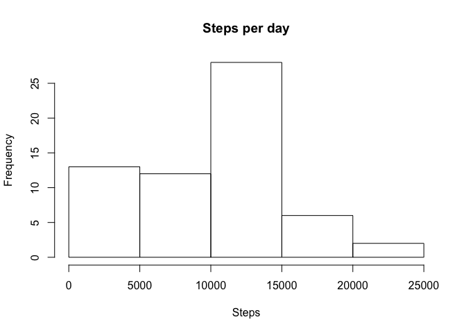
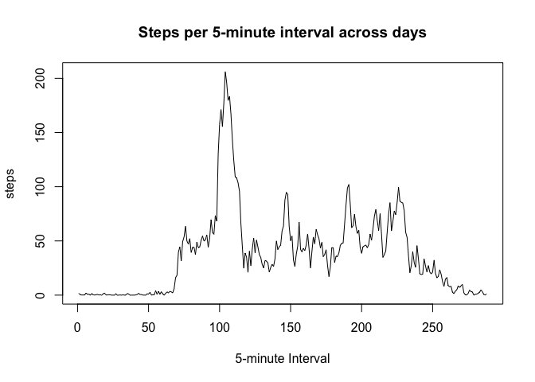
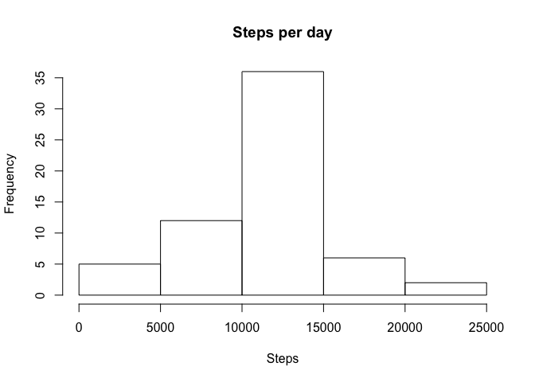
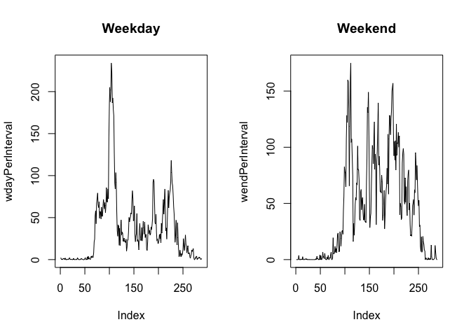

# Reproducible Research: Peer Assessment 1


## Loading and preprocessing the data
###Load the data (i.e. read.csv())

```r
steps<-read.csv("activity.csv")
```

###Process/transform the data (if necessary) into a format suitable for your analysis

```r
steps$date<-as.Date(steps$date)    #Convert date column from string to date

byDate<-split(steps$steps, steps$date)                      #split steps by date
stepsPerDay<-sapply(byDate, sum, na.rm=TRUE)            #add steps in intervals

byInterval<-split(steps$steps, steps$interval)                       #split steps by interval
stepsPerInterval<-sapply(byInterval, mean, na.rm=TRUE)               #average steps in intervals
```


## What is mean total number of steps taken per day?
###Make a histogram of the total number of steps taken each day

```r
hist(stepsPerDay, xlab="Steps",               #draw histogram
   main="Steps per day", ylab="Frequency")
```

 

###Calculate and report the mean and median total number of steps taken per day

```r
mean<-mean(stepsPerDay, na.rm=TRUE)         #Calculate the mean steps
print(mean)
```

```
## [1] 9354.23
```

```r
median<-median(stepsPerDay, na.rm=TRUE)     #Calculate the median steps
print(median)
```

```
## [1] 10395
```


## What is the average daily activity pattern?

###Make a time series plot (i.e. type = "l") of the 5-minute interval (x-axis) and the average number of steps taken, averaged across all days (y-axis)


```r
plot(stepsPerInterval, type='l', xlab="5-minute Interval", ylab="steps", 
     main="Steps per 5-minute interval across days")
```

 

###Which 5-minute interval, on average across all the days in the dataset, contains the maximum number of steps?

```r
maxInterval<-subset(stepsPerInterval, stepsPerInterval==max(stepsPerInterval))
print(names(maxInterval))
```

```
## [1] "835"
```


## Imputing missing values
###Calculate and report the total number of missing values in the dataset (i.e. the total number of rows with NAs)


```r
nrow(subset(steps, is.na(steps))) #subset based on NA, count rows in resulting df
```

```
## [1] 2304
```

###Devise a strategy for filling in all of the missing values in the dataset. The strategy does not need to be sophisticated. For example, you could use the mean/median for that day, or the mean for that 5-minute interval, etc.


```r
impute<-function(dfr){
     yn<-NULL
     x<-NULL
     
     for (i in dfr$steps){
          if(is.na(i)) x<-mean(dfr$steps, na.rm=TRUE)
          else x<-i
          yn<-c(yn,x)
     }
     return (yn)
}
```

###Create a new dataset that is equal to the original dataset but with the missing data filled in.


```r
imp<-impute(steps) 
imputedSteps<-steps
imputedSteps$steps<-imp
```

###Make a histogram of the total number of steps taken each day and 

```r
ibyDate<-split(imputedSteps$steps, imputedSteps$date)   #split steps by date
istepsPerDay<-sapply(ibyDate, sum, na.rm=TRUE)            #add steps in intervals

hist(istepsPerDay, xlab="Steps",               #draw histogram
     main="Steps per day", ylab="Frequency")
```

 

###Calculate and report the mean and median total number of steps taken per day. 

```r
mean<-mean(istepsPerDay, na.rm=TRUE)         #Calculate the mean steps
print(mean)
```

```
## [1] 10766.19
```

```r
median<-median(istepsPerDay, na.rm=TRUE)     #Calculate the median steps
print(median)
```

```
## [1] 10766.19
```

###Do these values differ from the estimates from the first part of the assignment? What is the impact of imputing missing data on the estimates of the total daily number of steps?

Yes they differ: they are higher using imputed data, because NA essentially means 0 when you add


## Are there differences in activity patterns between weekdays and weekends?
For this part the weekdays() function may be of some help here. Use the dataset with the filled-in missing values for this part.

###Create a new factor variable in the dataset with two levels -- "weekday" and "weekend" indicating whether a given date is a weekday or weekend day.


```r
imputedSteps$date<-as.Date(imputedSteps$date)
wkday<-sapply(imputedSteps$date, weekdays)

wkConv<-function(wkday) {
  yn<-NULL
  for (i in wkday){
    if(i=="Saturday") i<-"weekend"
    else if (i=="Sunday") i<-"weekend"
    else i<-"weekday"
    yn<-c(yn,i)
  }
  return (yn)
}

wkday<-factor(wkConv(wkday))
wkSteps<-cbind(steps,wkday)
```

###Make a panel plot containing a time series plot (i.e. type = "l") of the 5-minute interval (x-axis) and the average number of steps taken, averaged across all weekday days or weekend days (y-axis). The plot should look something like the following, which was created using simulated data:  

```r
byWeek<-split(wkSteps,wkSteps$wkday)

wday<-byWeek$weekday
wdaybyInterval<-split(wday$steps, wday$interval)      #split steps by interval
wdayPerInterval<-sapply(wdaybyInterval, mean, na.rm=TRUE) #average steps in intervals

wend<-byWeek$weekend
wendbyInterval<-split(wend$steps, wend$interval)      #split steps by interval
wendPerInterval<-sapply(wendbyInterval, mean, na.rm=TRUE) #average steps in intervals

par(mfrow=c(1,2))
plot(wdayPerInterval, main="Weekday", type='l')
plot(wendPerInterval, main="Weekend", type='l')
```

 

